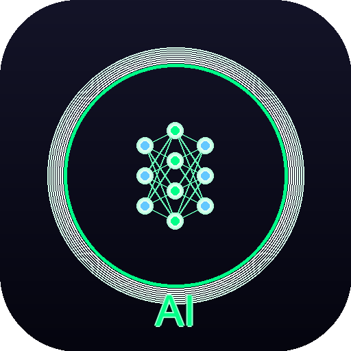

# 🤖 AI Screen Assistant

ແອັບພລິເຄຊັນທີ່ສາມາດສະແກນຈໍ ແລະ ຕອບຄຳຖາມ MCQ ໄດ້ອັດຕະໂນມັດ



## ✨ ຄຸນສົມບັດ

- 📸 ສະແກນຈໍສະແດງຜົນແບບ Real-time
- 🔍 ອ່ານຂໍ້ຄວາມດ້ວຍ OCR (ໄວພຽງ 2 ວິນາທີ)
- 🧠 ວິເຄາະ ແລະ ຕອບຄຳຖາມ MCQ
- 📐 ແກ້ໂຈດຄະນິດສາດ (Arithmetic, Equations, Geometry)
- 🎯 ສະແດງຄຳຕອບເທິງຈໍ (Overlay)
- ⚡ ຮອງຮັບຫຼາຍພາສາ (ອັງກິດ, ລາວ, ໄທ)
- 🎨 UI ສວຍງາມ + ຟີເຈີພິເສດ

## 📋 ຄວາມຕ້ອງການຂອງລະບົບ

- **OS:** Windows 10/11 (64-bit)
- **RAM:** 4GB ຂຶ້ນໄປ
- **Tesseract OCR 5.x** (ຈຳເປັນ)
- **Python 3.10+** (ສຳລັບ Source Code)

## 🚀 ການຕິດຕັ້ງ

### ວິທີທີ 1: ໃຊ້ Installer (ແນະນຳ)

1. ດາວໂຫຼດ `AI-Screen-Assistant-v3-Setup.exe`
2. ຮັນ Installer
3. ຕິດຕາມຄຳແນະນຳ
4. ເປີດແອັບຈາກ Desktop

### ວິທີທີ 2: ຮັນຈາກ Source Code

```bash
# 1. Clone repository
git clone https://github.com/yourusername/ai-screen-assistant.git
cd ai-screen-assistant

# 2. ຕິດຕັ້ງ Tesseract OCR
# ດາວໂຫຼດຈາກ: https://github.com/UB-Mannheim/tesseract/wiki

# 3. ຕິດຕັ້ງ Libraries
pip install -r requirements.txt

# 4. ຮັນແອັບ
python run_final_v3.py